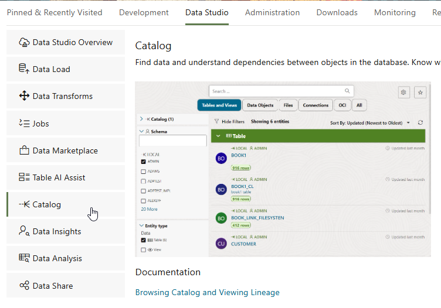
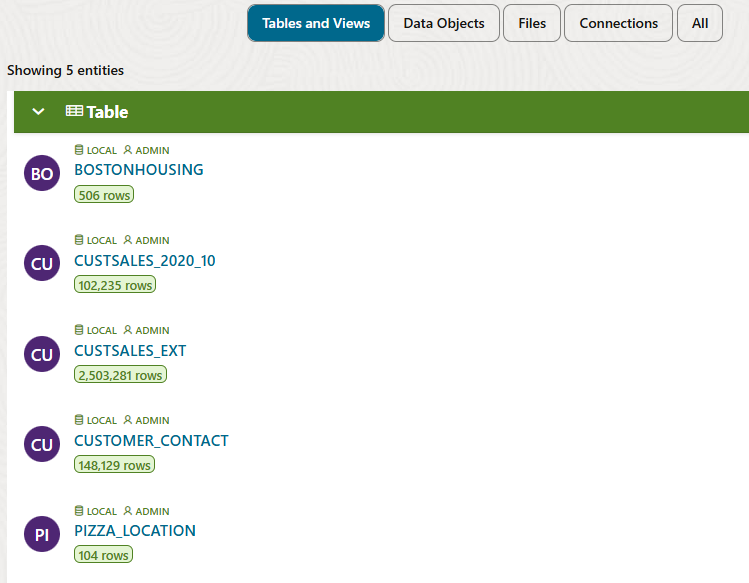
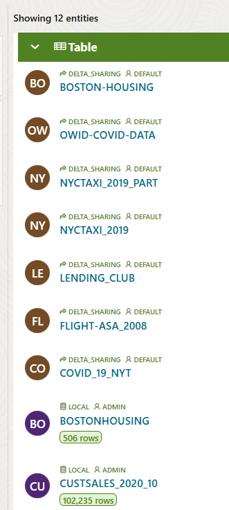
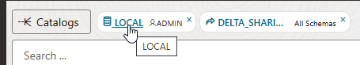
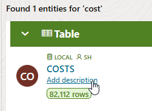
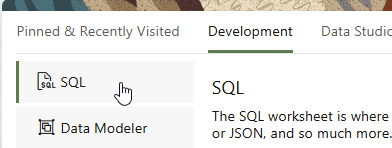
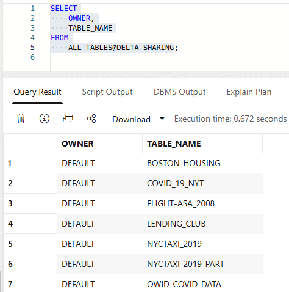
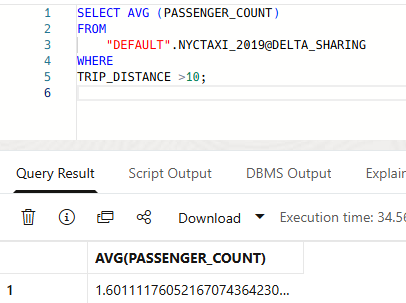
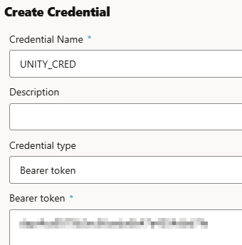
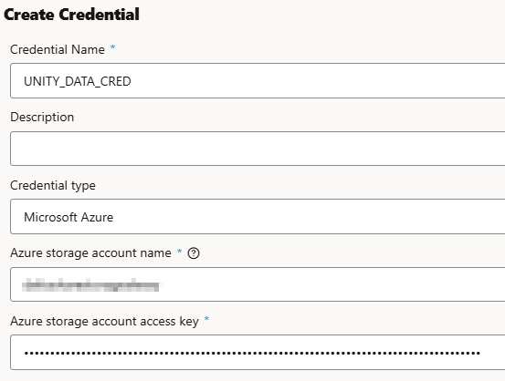

# Enable Federated Data Access using the Autonomous AI Lakehouse Catalog

## Introduction

The Autonomous AI Lakehouse includes a 'catalog of catalogs' that allows you to connect to existing catalogs, databases, shares and data lakes. Once a catalog is added over one of these systems, users can immediately search for and discover relevant data from it, and can query the data as if it were local to the AI Lakehouse, without moving it.

In this lab, we will learn how the AI Lakehouse adds catalog connections, and show how we can look for and use data across multiple catalogs.

Estimated Time: 10 minutes

### Objectives

In this lab, you will:

* Use AI Lakehouse's Catalog app to search and use data across catalogs
* Learn how to add external Iceberg catalogs such as Databricks Unity
* Understand how to query catalogs and their data from SQL

### Prerequisites

This lab requires the completion of the following labs/tasks from the **Contents** menu on the left:

* **Lab 1: Set up the Workshop Environment > Task 2:  Provision the Autonomous AI Database Instance**.

* **Lab 5: Consume a shared dataset using the Delta Sharing protocol**.


## Task 1: Use the Catalog to search for data

In the last lab, you subscribed to an example Delta Share. In doing so, you added a catalog, so that users can search for and discover data from the share, in addition to data already in the AI Lakehouse. 

 **Note:** In the last lab, you created an external table *BOSTONHOUSING* from the newly subscribed share. However, you can also directly query the other tables in the share.

1. Navigate to the **Catalog** in the **Data Studio** section of the Database Actions page.



By default, the catalog shows tables and views for your user in your AI Lakehouse - the 'LOCAL' catalog:



We can add any available catalogs to expand our data search.

2. Click on the **Catalogs** button in the top left. Tick the box next to the **DELTA\_SHARING** catalog to include it. Then click Apply at the bottom of the screen.

3. The table list is now refreshed to include tables in the **DELTA\_SHARING** catalog:



4. In the **LOCAL** catalog, we currently only have the **ADMIN** schema selected. We can add more schemas if required. Click the text LOCAL at the top of the screen



5. In the box below 'All Schemas', type 'SH' to add the SH schema, and click **Apply**. Scroll down the list of tables to see that tables from the SH schema now appear in the list. 

Note that some of the tables in the SH schema contain descriptions. These are comments in the data dictionary that help us understand the table contents. These descriptions are displayed in the catalog, and can also be updated from here.

6. We now have two catalogs and multiple schemas selected. To find a particular table, we can use the search bar at the top. Type in 'cost' and press the Enter key to search. 

This finds a 'COSTS' table in the SH schema. This table currently does not have a description. Hover over the table until the **Add description** link appears, then click it:



If you have an AI profile set up, you can use it to auto-generate a table description from the table metadata (such as the names of the columns). If not, you can type (or copy and paste) a description in, such as:

```
<copy>
   Aggregates unit costs and prices across channels, products, promotions and time
</copy>
```

7. So far, we have used the UI to discover tables in the catalogs available to the AI Lakehouse. We can also do this from SQL. First, navigate to **SQL** from the **Development** section of the Database Actions page.



8. On the left hand side, the UI shows the tables in the ADMIN schema of the local catalog. However, we know that other catalogs are available. Copy, paste and run the following SQL to list additional catalogs:

```
<copy>
  SELECT
    CATALOG_NAME,
    CATALOG_TYPE,
    IS_ENABLED
  FROM
    USER_MOUNTED_CATALOGS;
</copy>
```
This shows our **DELTA\_SHARING** catalog. 

9. Copy, paste and run the following SQL to list the tables in the **DELTA\_SHARING** catalog:

```
<copy>
SELECT
    OWNER,
    TABLE_NAME
FROM
    ALL_TABLES@DELTA_SHARING;
</copy>
```

This lists all the tables in the share catalog we subscribed to in the last lab:



10. Now that we know the catalog name (**DELTA\_SHARING**), the owner or schema name (**DEFAULT**) and the set of tables in this schema, we have enough information to query the data, as tables in external catalogs can be queried directly using the following syntax:

SELECT * FROM OWNER.TABLENAME@CATALOGNAME

Copy, paste, and run the following example query of the **NYCTAXI\_2019** table. This returns the average number of passengers who took taxi journeys of over 10 miles in 2019: 

(Note that **DEFAULT** should be enclosed in double quotes)

```
<copy>
SELECT AVG (PASSENGER_COUNT)
FROM
    "DEFAULT".NYCTAXI_2019@DELTA_SHARING
WHERE
TRIP_DISTANCE >10;
</copy>
```

This should return a result of just over 1.60 passengers:



This example query shows that we can dynamically query external data using the catalog to provide federated access. 

## Task 2: Add an Iceberg catalog

We can extend the 'catalog of catalogs' with as many catalogs as we like, and search for and query data in the same way as in Task 1. Catalogs can be added over any of the following:

* Other Autonomous AI Databases
* Other Databases that can be connected using DB Links, such as Oracle, Azure SQL, or MySQL databases
* Existing Data Catalogs, such as AWS Glue or OCI Data Catalog
* Live and Delta Shares
* Iceberg Catalogs, such as Snowflake Open Catalog, Databricks Unity Iceberg Catalogs, or Apache Polaris catalogs

In this task, we will show an example of adding an Iceberg catalog from Databricks Unity.

_**Note:** This is not a hands-on task, unless you have a Databricks Unity Iceberg catalog to connect to. This task shows how to add and use such a catalog. If you do have an Iceberg catalog in Databricks Unity, you will need the Iceberg catalog URL and a bearer token to connect to it, as well as credentials to enable access to the cloud storage bucket for the Iceberg data_

1. First, we need to enable the Autonomous AI Lakehouse to access the relevant external resources. As ADMIN, adapt and run the following example SQL to enable access. Note that this example is typical for an Azure Databricks Unity catalog with Azure Data Lake storage:

```
<copy>
BEGIN
  dbms_network_acl_admin.append_host_ace(
    host => '*.azuredatabricks.net',
    lower_port => 443,
    upper_port => 443,
    ace => xs$ace_type(
      privilege_list => xs$name_list('http', 'http_proxy'),
      principal_name => 'ADMIN',
      principal_type => xs_acl.ptype_db));

  dbms_network_acl_admin.append_host_ace(
    host => '*.blob.core.windows.net',
    ace => xs$ace_type(
      privilege_list => xs$name_list('http', 'http_proxy'),
      principal_name =>  'ADMIN',
      principal_type => xs_acl.ptype_db));
END;
/
</copy>
```
 **Note:** This SQL allows access for the ADMIN user. To enable access for another user, change the principal name in each of the statements to the relevant DB User, noting the SQL itself should be run by the ADMIN user.


2. Now we are ready to add the catalog. Navigate back to the **Catalog** from the **Data Studio** section of the Database Actions page.

3. Click the **Catalogs** button in the top left.

4. Click the **Add** button in the top right to add a new catalog.

5. Select **Iceberg catalog** from the list of the types of catalog that can be added, and click **Next**.

6. The **Catalog name** (the first field) is the name of the catalog in the Autonomous AI Lakehouse. Type in **UNITY**.

7. Paste in your Iceberg catalog endpoint from Databricks Unity. This is likely to be in the following format:

https://DATABRICKSADDRESS.azuredatabricks.net/api/2.1/unity-catalog/iceberg-rest/v1/catalogs/CATALOGNAME

 **Note:** It is important to include the catalog name in the URL.

8. Under **Iceberg catalog credential**, click the **Create Credential** button.  

9. Under **Credential type**, change the selection to **Bearer token**.

10. Paste in your bearer token from Databricks, then give your credential a name (such as 'UNITY\_CRED'). 



Then click **Create Credential** at the bottom of the screen.

11. Under **Bucket credentials**, click on the **Create Credential** button.

12. Change the Credential type to the type of the cloud storage bucket used for the Iceberg catalog, for example **Microsoft Azure**.

13. Paste in your cloud object storage credentials, for example your Azure storage account name and access key, and give your credential a name, such as **UNITY\_DATA\_CRED**.



Then click **Create Credential** at the bottom of the screen.

14. In the **Add Catalog** screen, make sure you have your newly created catalog and cloud storage credentials selected, then click **Next**

15. **Important** The final step of the wizard shows the namespaces that exist in the Unity Data Catalog. This is useful to check you have the catalog details correct. However, the AI Lakehouse catalog considers these as 'schemas' and uses APIs at the catalog level. You should therefore leave the namespace blank rather than selecting a namespace. Click the **Add** button to add the catalog. Then click the **Close** button to return to the main catalog screen.

## Task 3: Explore the Iceberg catalog

We have now connected the Autonomous AI Lakehouse to a Databricks Unity Iceberg catalog, making all of the Iceberg data available to search, discover and query in the AI Lakehouse!

To explore the catalog, try out any of the following actions:

1. Click the **UNITY** catalog in the Catalog UI and select any of the schemas that you want to use.

2. Click on any of the tables in the catalog and click **Preview** to see the data.

3. Choose to load or link data from any Unity Iceberg table using the **Load to table** or **Link to table** options for the table in the Catalog UI.

4. Query the table using SQL, such as SELECT * from NAMESPACE.TABLENAME@UNITY;

## Learn more

* [Manage catalogs using the DBMS\_CATALOG package](https://docs.oracle.com/en/cloud/paas/autonomous-database/serverless/adbsb/dbms-catalog.html)
* [The Catalog tool in Autonomous AI Lakehouse](https://docs.oracle.com/en/cloud/paas/autonomous-database/serverless/adbsb/catalog-entities.html)

You may now proceed to the next lab.

## Acknowledgements

* **Author:** Mike Matthews, Product Management, Oracle Autonomous AI Lakehouse
* **Contributor:** Lauran K. Serhal, Consulting User Assistance Developer
* **Last Updated By/Date:** Mike Matthews, March 2026

Data about movies in this workshop were sourced from Wikipedia.

Copyright (C) 2026 Oracle Corporation.

Permission is granted to copy, distribute and/or modify this document
under the terms of the GNU Free Documentation License, Version 1.3
or any later version published by the Free Software Foundation;
with no Invariant Sections, no Front-Cover Texts, and no Back-Cover Texts.
A copy of the license is included in the section entitled [GNU Free Documentation License](https://oracle-livelabs.github.io/adb/shared/adb-15-minutes/introduction/files/gnu-free-documentation-license.txt)


